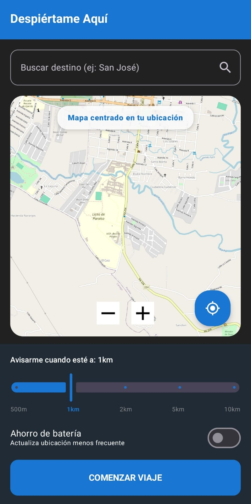
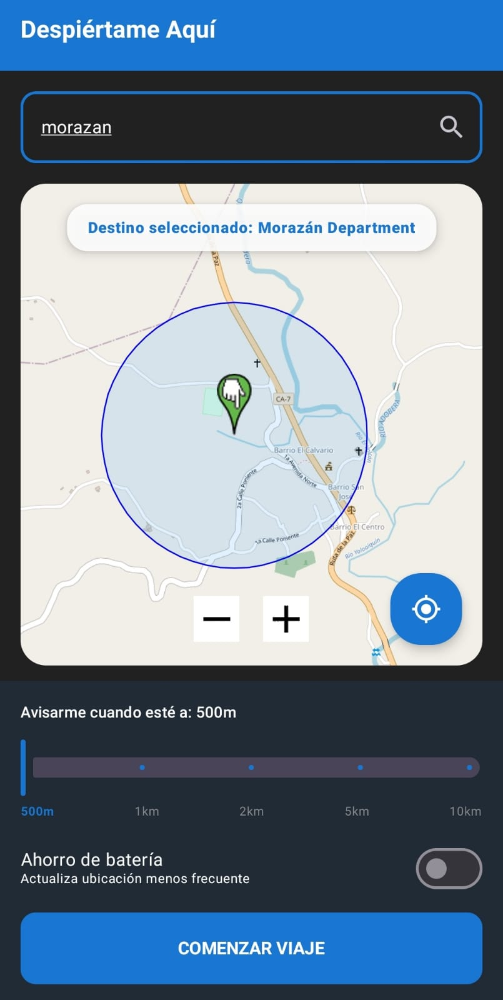
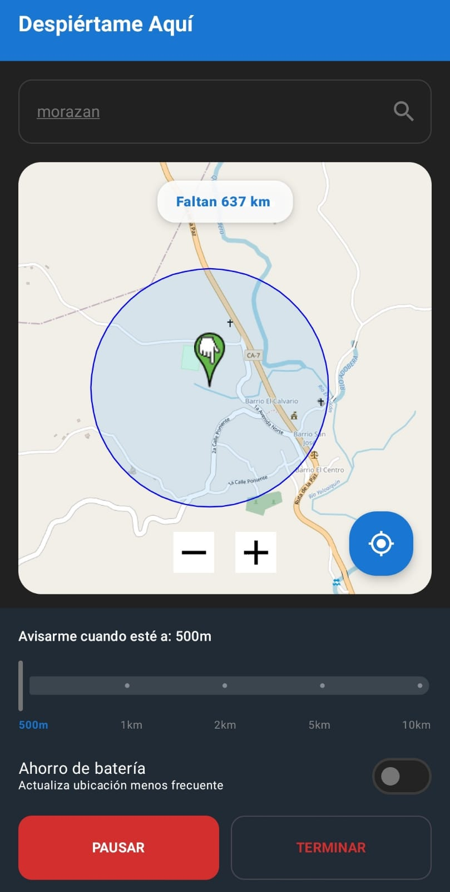
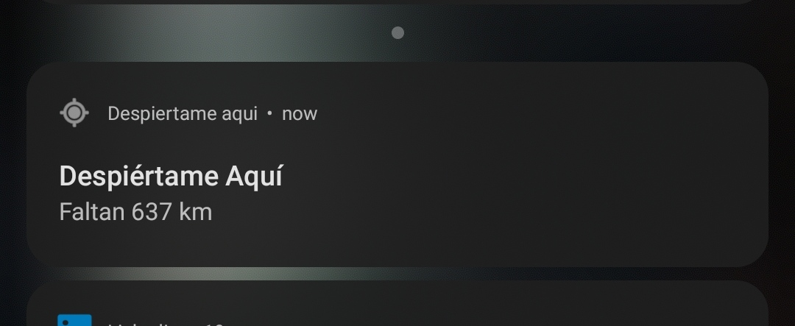

# Despiértame Aquí

Aplicación Android que monitorea la ubicación durante un viaje y avisa al usuario antes de llegar a su destino. Está pensada para personas que quieren descansar en el autobús sin preocuparse por perder su parada.

> Proyecto de portafolio desarrollado en Kotlin con Jetpack Compose, seguimiento de ubicación en primer plano y mapas de OpenStreetMap.

## El problema que resuelve

En trayectos largos es fácil quedarse dormido o distraerse y pasar de largo la parada. **Despiértame Aquí** permite seleccionar un destino, definir una distancia de aviso y mantener un seguimiento visible mientras el viaje está activo.

## Funcionalidades

- Selección del destino tocando directamente el mapa.
- Búsqueda de lugares mediante geocodificación.
- Centrado del mapa en la ubicación actual del usuario.
- Radio de aviso configurable: 500 m, 1 km, 2 km, 5 km o 10 km.
- Seguimiento de ubicación mediante un `Foreground Service`.
- Distancia restante actualizada en la app y en una notificación persistente.
- Modo de ahorro de batería con menor frecuencia de actualización.
- Alarma sonora al entrar en el radio configurado.
- Controles para pausar, reanudar y terminar el viaje.
- Bloqueo del destino y la configuración durante un viaje activo.
- Persistencia del estado del viaje al cerrar y volver a abrir la aplicación.
- Mapas de OpenStreetMap sin necesidad de una clave privada de Google Maps.

## Flujo principal

1. El usuario concede acceso a su ubicación.
2. Busca un destino o lo marca sobre el mapa.
3. Configura la distancia a la que desea recibir el aviso.
4. Inicia el viaje.
5. El servicio calcula periódicamente la distancia restante.
6. Al entrar en el radio seleccionado, la aplicación reproduce la alarma.

## Tecnologías

| Área | Tecnología |
|---|---|
| Lenguaje | Kotlin |
| Interfaz | Jetpack Compose + Material 3 |
| Mapas | osmdroid + OpenStreetMap |
| Ubicación | Google Play Services Location |
| Procesamiento en segundo plano | Android Foreground Service |
| Estado local | Compose state + SharedPreferences |
| Build | Gradle Kotlin DSL |
| CI | GitHub Actions |

## Arquitectura

La aplicación mantiene una estructura deliberadamente pequeña y fácil de revisar:

```text
MainActivity / Compose UI
├── búsqueda y selección de destino
├── mapa, marcador y radio de aviso
├── controles del viaje
└── estado persistente del viaje
             │
             ▼
LocationService
├── actualizaciones de ubicación
├── cálculo de distancia y tiempo estimado
├── notificación persistente
└── activación de la alarma
```

`MainActivity` concentra la experiencia de usuario y envía acciones explícitas al servicio. `LocationService` continúa el seguimiento mientras la aplicación no está en primer plano y comunica los cambios de distancia a la interfaz.

## Permisos

La aplicación solicita únicamente los permisos necesarios para sus funciones:

- Ubicación precisa o aproximada.
- Servicio en primer plano de tipo ubicación.
- Notificaciones en versiones recientes de Android.
- Vibración y acceso a Internet para el mapa.

La ubicación se procesa localmente en el dispositivo. Este proyecto no incluye servidor propio, cuentas de usuario ni almacenamiento remoto de recorridos.

## Requisitos

- Android 7.0 (API 24) o superior.
- Android Studio compatible con AGP 9.1.1.
- JDK 17 o superior.
- Conexión a Internet para cargar el mapa y realizar búsquedas.
- Servicios de ubicación activos.

## Compilación

Clona el repositorio y ejecuta:

```bash
git clone https://github.com/Mangelbarboza/DespiertameAqui.git
cd DespiertameAqui
./gradlew assembleDebug
```

En Windows:

```powershell
.\gradlew.bat assembleDebug
```

El APK se genera en `app/build/outputs/apk/debug/app-debug.apk`.

## Decisiones técnicas destacadas

- **Sin claves dentro del repositorio:** OpenStreetMap evita exponer una API key para el mapa.
- **Servicio en primer plano:** hace visible el seguimiento y permite que continúe fuera de la pantalla principal.
- **Estado de viaje persistente:** evita modificar accidentalmente el destino cuando existe un seguimiento activo.
- **Frecuencia adaptable:** el modo de ahorro reduce las consultas de ubicación para consumir menos batería.
- **Identificación de cliente OSM:** las solicitudes utilizan un agente propio y estable conforme a la política pública de mosaicos.

## Limitaciones actuales

- La precisión y frecuencia pueden variar según el dispositivo, señal GPS y políticas de ahorro de energía del fabricante.
- La búsqueda depende del servicio de geocodificación disponible en el dispositivo.
- Los mosaicos de OpenStreetMap requieren conexión y se ofrecen sin garantía de disponibilidad.
- Antes de una publicación comercial se recomienda añadir pruebas instrumentadas del flujo completo y firma de producción.

## Próximas mejoras

- Historial local de destinos frecuentes.
- Selector de sonido y vibración de alarma.
- Navegación accesible y mejoras para lectores de pantalla.
- Pruebas de UI y cobertura del servicio de ubicación.
- Distribución firmada mediante Google Play Internal Testing.

## Estado del proyecto

Versión de portafolio funcional: **1.3**. El repositorio incluye una compilación automatizada para validar el proyecto en cada cambio.

Map data © [OpenStreetMap contributors](https://www.openstreetmap.org/copyright).

## Capturas

### Ubicación actual y configuración del aviso

<p align="center">
  
</p>

### Destino y radio seleccionados

<p align="center">
  
</p>

### Viaje activo

<p align="center">
  
</p>

### Seguimiento desde la notificación

<p align="center">
  
</p>
